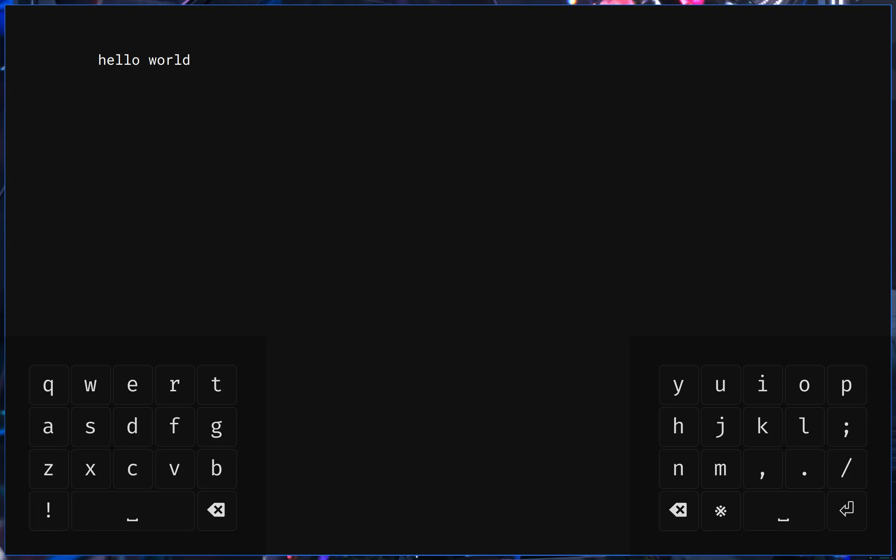

This is a heavily modified version of [ptazithos/wkeys](https://github.com/ptazithos/wkeys).

Note this is designed for my own use; feel free to fork but I likely won't maintain or add features outside of my own needs.

[N-grams are sourced from here](https://github.com/orgtre/google-books-ngram-frequency/tree/main/ngrams), derived from the Google Books Ngram Corpus on books published in 2010-2019.

## Dependencies

```bash
# For autocorrect.
sudo zypper in enchant-devel

# Pointer control uses `uinput` and requires special permissions.
# Add your user to the `input` group:
sudo usermod -a -G input $USER

# Add to `/etc/udev/rules.d/99-input.rules`,
# which ensures that the `input` group has the correct permissions.
KERNEL=="event*", SUBSYSTEM=="input", GROUP="input", MODE="0660"
KERNEL=="uinput", GROUP="input", MODE="0660"

# Reload the udev rules:
sudo udevadm control --reload-rules
sudo udevadm trigger

# If you added your user to the `input` group
# you need to login/logout for the changes to take effect.
sudo reboot
```

## Features

- Written for Wayland
- Virtual split, multi-layer keyboard
- Show/hide the keyboard
- Multiple gestures per key:
  - Tap
  - Hold-repeat
  - 4-direction swipe
    - Swipe-hold
    - Swipe-release
    - Swipe-drag
- Layout configured in YAML
- Special tap actions:
  - Execute command
  - Mouse/pointer buttons
  - Cursor control: tap-and-hold to move the pointer
    and bring up a mouse control layer.
- Special swipe actions:
  - Move text cursor (swipe-drag to move cursor in that direction)
  - Select text (swipe-drag to select text)
  - Delete text (swipe-drag to delete text)
    - NOTE: A problem with the current implementation is that if the selection is empty, one character will still be deleted.
  - Activate layer (while swipe is held)
  - Fire tapped key with a modifier (e.g. swipe up to send shifted key)

## Layout

A layout is defined in YAML like so:

```yaml
# Define the left layout.
# A layout side consists of one or more layers.
left:
  # The first layer is the base/default layer.
  # A layer consists of one or more rows.
  # A row consists of one or more key definitions.
  - - - key: KEY_Q
      - key: KEY_W
    # Another row.
    - - key: KEY_E
      - key: KEY_R
  # Another layer
  - - - key: KEY_T
      - key: KEY_Y
    - - key: KEY_U
      - key: KEY_I

# Define the right layout.
# Same structure as the left layout.
right: # ...
```

There are a few different kinds of key definitions:

- A _basic_ key, with optional swipe actions.
- A _pointer_ key, which controls the cursor/pointer.
- A _command_ key, which executes a command when tapped.

```yaml
left:
  - - - key: KEY_Q

      # Basic key.
      # Everything except `key` is optional.
      # The key is defined using the constants here:
      # <https://docs.rs/evdev/latest/evdev/struct.Key.html>
      - key: KEY_W

        # Define the key width, relative to
        # a single key.
        width: 2

        # Modifiers to be sent with the key.
        modifiers: [Alt, Ctrl, Shift, Meta]

        # Provide a custom label instead of the default.
        label: "W"

        # Define swipe actions.
        # Separate actions can be defined for
        # [n]orth, [s]outh, [e]ast, [w]est.
        n:
          # An alternate basic key.
          Key: KEY_Y

        s:
          # Switch the active layer (by index)
          # on the specified side
          # while this swipe is held.
          Layer: [Right, 1]

        e:
          # Send the main key with this modifier.
          Modified: Shift

           # Drag the text cursor in the swipe direction.
        w: Arrow

        # Note: only one action can be defined for each direction; more are here just to show all possible swipe actions.

           # Mouse scroll in the swipe direction.
        n: Scroll

           # Select text in the swipe direction.
        n: Select

           # Delete text in the swipe direction.
        n: Delete

           # Hide the keyboard.
        n: HideKeyboard

      # Pointer key.
      - Pointer

      # Command key.
      # `args` is optional.
      - cmd: notify-send
        args: [hello]
        label: "!"
```

## Known Issues

When a drag/swipe gesture leaves the keyboard's window GTK reports discontinuous offset values. For example, if you're dragging towards the edge of the keyboard window you may see an x-offset of `-100` and then once you leave the window the x-offset suddenly jumps to `600`. I'm not sure if this is a bug or if this is part of how Wayland handles pointers. In any case this means that swipe/drag gestures will be sensible only within the bounds of the keyboard windows.


## Roadmap

- [ ] Autocorrect
- [ ] Auto-rotation

